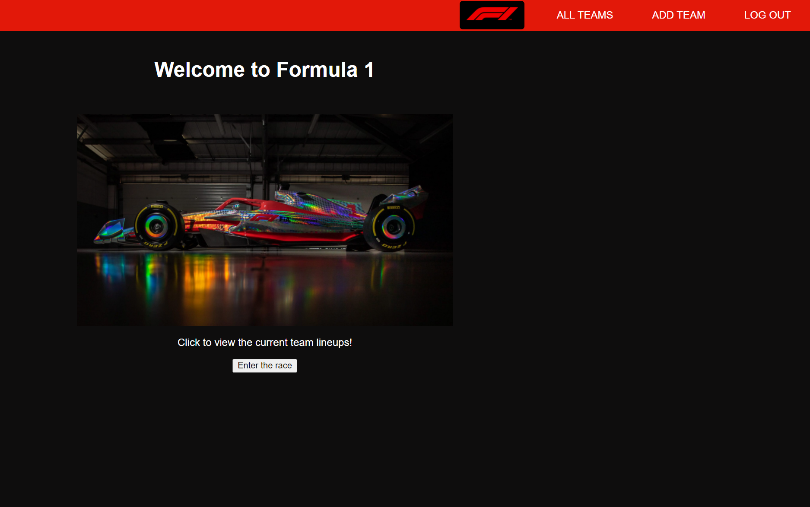
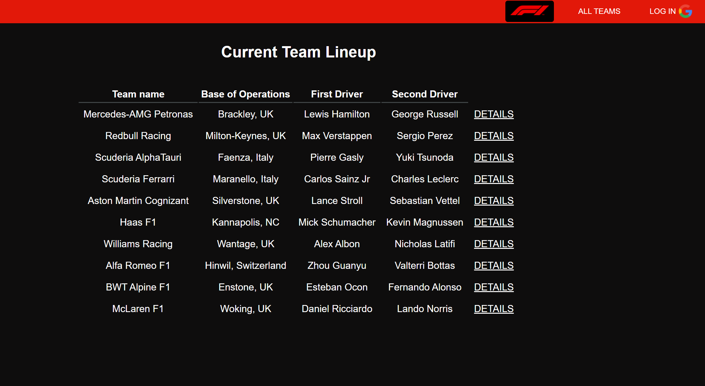
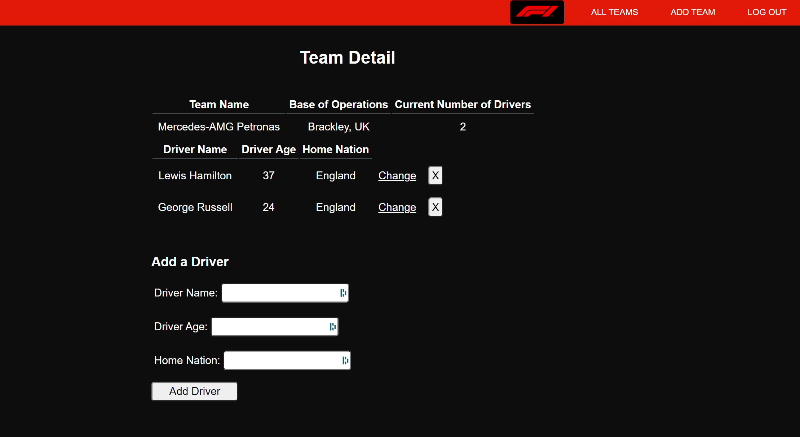

# F1-Team-Tracker
This is my second project for General Assembly. For this project, we were challenged to create an Node.JS/Express website that had full CRUD functionality. I made use of 7  RESTful routes including Index, New, Delete, Update, Create, Edit, and Show. I went with this concept for the site as Formula one is something that I am passionate about, and wanted a way to track which drivers are currently driving for which teams.

## Technologies Used
1. Node.js
2. MongoDB with Mongoose
3. Atlas Database
4. Express Server Generator
5. Heroku App Hosting
6. Embedded JavaScript (ejs)
7. CSS Styling
8. Trello
9. Github
10. Git
11. Google OAuth 

## Getting Started
Check out the app using [this link](https://f1-team-tracker.herokuapp.com/)

Check out the Trello board including initial wireframes and the ERD using [this link](https://trello.com/b/1TYvVGVm)

## Next Steps
1. Team Based theming on the Show pages through CSS classes
2. Increase funtionality to better track drivers
3. Look into using an API to populate data such as race results
4. Order teams dynamically based on constructors championship points

## Screenshots

